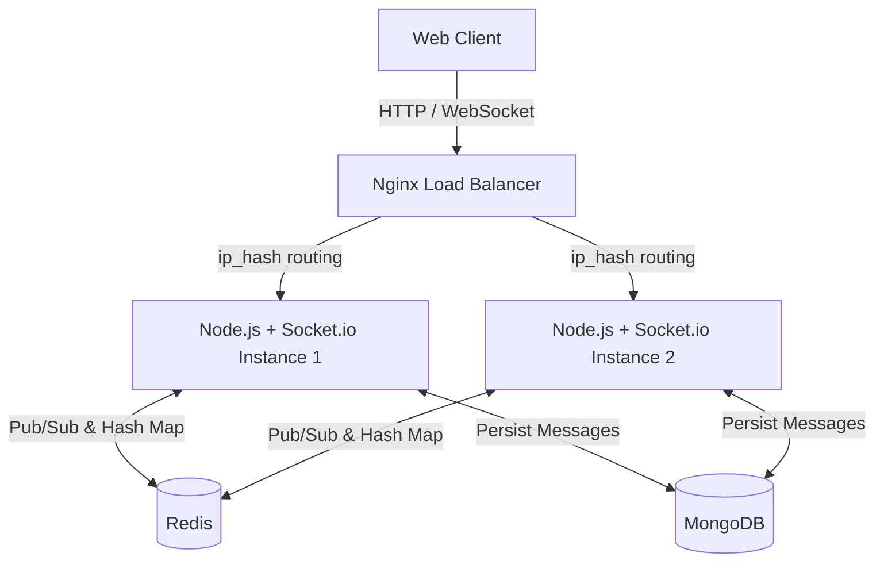

# Echo Chamber


A highly scalable, real-time chat application designed to demonstrate robust backend architecture, state management, and real-time event synchronization across multiple server instances.

## 🛠️ Tech Stack

- **Frontend**: React, Vite, Tailwind CSS
- **Backend**: Node.js, Express, Socket.io
- **Infrastructure**: Nginx (Load Balancer / Reverse Proxy), Docker & Docker Compose
- **Databases**: MongoDB (Persistent Storage), Redis (Pub/Sub & Presence)

## 🚀 Features

- **Horizontal Scalability:** Runs 2 backend Node.js replicas behind an Nginx load balancer to seamlessly handle high traffic.
- **Real-Time Sync via Redis:** Uses Redis Pub/Sub to instantly route WebSocket events between users, even if they are connected to completely different backend server instances.
- **Auth-Verified WebSockets:** The Socket.io connection handshake is securely verified using JWT middleware, eliminating spoofing and locking down real-time event rooms.
- **Smart Delivery States:** WhatsApp-style ticks (`✓` sent, `✓✓` delivered, blue `✓✓` read) with full real-time ack propagation.
- **Offline Message Resync:** If a client drops their connection, they automatically fetch and merge missed messages upon reconnecting.
- **Live Presence & Typing:** Real-time "Online/Offline" presence tracking and debounced `typing...` indicators.
- **Sticky Sessions:** Nginx `ip_hash` configuration ensures proper Socket.io upgrade handshakes in a multi-server environment.
- **Data Persistence:** All messages and users are securely stored in MongoDB.

## 🧠 Design Decisions

- **Redis Pub/Sub vs Direct Instance Communication:** With multiple backend instances, if User A is connected to Node-1 and User B to Node-2, Node-1 needs a way to pass messages to Node-2. Redis Pub/Sub allows Node-1 to publish the message to a channel that Node-2 subscribes to, instantly bridging the gap with virtually zero latency.
- **Sticky Sessions alongside Redis:** A common question is: *"If Redis handles cross-instance broadcast, why do you also need Nginx sticky sessions (`ip_hash`)?"* The answer is the **WebSocket handshake**. Socket.io initially connects via HTTP long-polling and upgrades to WebSockets. If the load balancer sends the HTTP upgrade request to Node-1, but the subsequent handshake packet to Node-2, the connection will be rejected with a 400 error. Sticky sessions ensure the handshake sequence stays on a single instance.

## 🏗️ Architecture



## 🛠️ Quick Start

The entire stack is containerized with Docker. You don't need Node.js or MongoDB installed locally — just Docker!

### 1. Prerequisites
- [Docker](https://www.docker.com/products/docker-desktop)
- [Docker Compose](https://docs.docker.com/compose/install/)

### 2. Environment Setup
Copy the sample environment file:
```bash
cp .env.example .env
```
*(Optionally modify the `.env` values, though the defaults work immediately with Docker Compose).*

### 3. Start the Stack
Run the following command in the root directory:
```bash
docker compose up --build -d
```
*This spins up 5 containers: 1 Nginx Frontend, 2 Node.js Backends, 1 Redis instance, and 1 MongoDB instance.*

### 4. Open the App
Navigate to **[http://localhost](http://localhost)** in your browser. 
Open a second browser tab (or an incognito window) to create a second account and test real-time chatting between the two!

---

## 📈 Load Testing

A custom Artillery load-testing script is included to prove the architecture's resilience under heavy concurrent WebSocket connections. 

In local benchmarks (Windows 11, Intel Core i7-10750H, 16GB RAM running Docker Desktop WSL2), this 2-replica setup successfully maintained stable latencies (< 50ms) for over **~1,750 concurrent chatting users**. 

**Hardware Limits Hit**: At around ~1,850 connections, the CPU usage of the Node.js containers maxed out at 100%, causing event loop lag. This resulted in Socket.io ping timeouts, triggering dropped connections and `ETIMEDOUT` errors in the Artillery logs. Scaling the replica count to 4 resolved the bottleneck, proving the horizontal scaling model works.

To run the load test:
```bash
cd loadtest
npm ci
npm start
```
